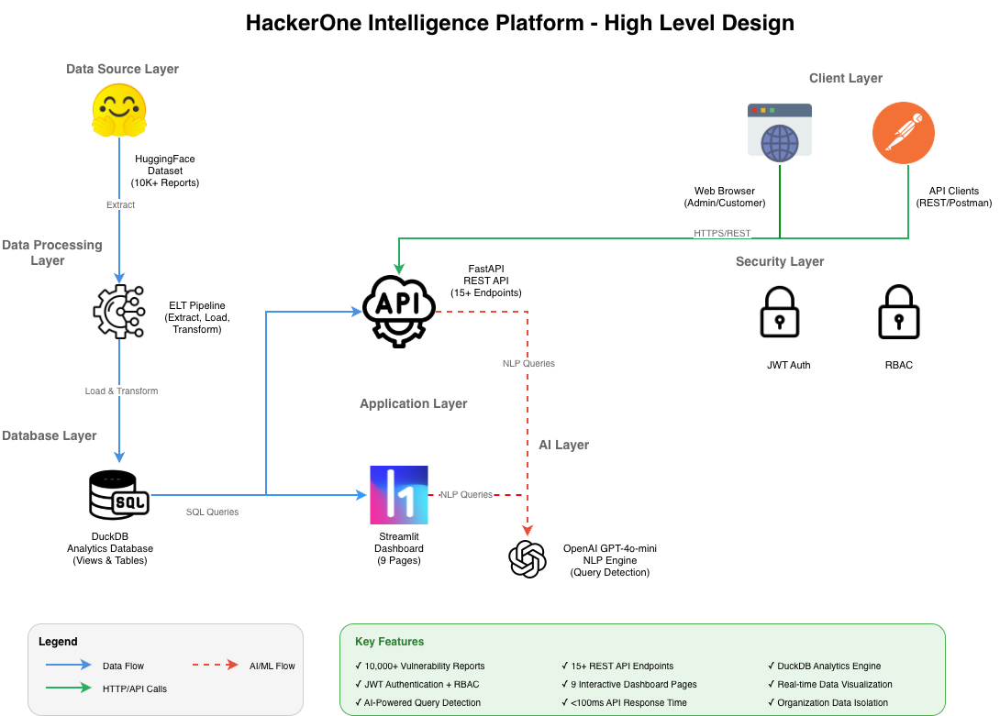
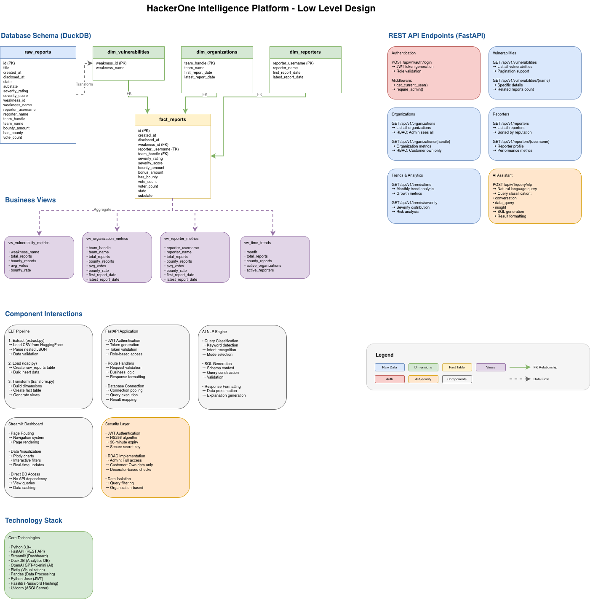

# HackerOne Intelligence Platform

> **AI-first** enterprise vulnerability intelligence platform with natural language querying, intelligent insights, RESTful API, and interactive dashboards.

**[🚀 View Live Dashboard](https://hackerone-intelligence-platform.streamlit.app/)**

[](https://www.python.org/downloads/)
[](https://fastapi.tiangolo.com/)
[](https://streamlit.io/)
[](https://duckdb.org/)
[](https://openai.com/)

## Overview

An **AI-first**, production-ready intelligence platform that transforms 10,000+ HackerOne vulnerability reports into actionable insights through:

- **AI Assistant** - Natural language queries with intelligent SQL generation powered by OpenAI GPT-4o-mini
- **Intelligent Insights** - Automated pattern detection and vulnerability trend analysis
- **Interactive Dashboard** - Real-time analytics with 9 specialized pages and AI-powered exploration
- **Secure REST API** - JWT authentication with role-based access control
- **High Performance** - DuckDB-powered analytics with <100ms response times

## Architecture

### High-Level Design (HLD)



**[View Editable HLD Diagram](docs/HLD_Architecture.drawio)** (Open in [draw.io](https://app.diagrams.net/))

### Low-Level Design (LLD)



**[View Editable LLD Diagram](docs/LLD_Architecture.drawio)** (Open in [draw.io](https://app.diagrams.net/))

The LLD diagram shows:
- **Database Schema**: Star schema with fact and dimension tables
- **Business Views**: Pre-aggregated metrics for performance
- **REST API Endpoints**: All 15+ API routes with authentication
- **Component Interactions**: ELT pipeline, API, Dashboard, AI Engine
- **Technology Stack**: Complete tech stack with versions

**Tech Stack:** Python • FastAPI • Streamlit • DuckDB • OpenAI • Plotly • JWT

## Quick Start

### Prerequisites
- Python 3.11+
- OpenAI API key (optional, for AI features)

### Installation

```bash
# 1. Install dependencies
pip install -r requirements.txt

# 2. Load data (downloads 10K+ reports from HuggingFace)
python run_pipeline.py

# 3. Configure AI (optional)
cp .env.example .env
# Add OPENAI_API_KEY to .env
```

### Running the Platform

**Dashboard (Streamlit)**
```bash
python run_dashboard.py
# → http://localhost:8501
```

**API Server (FastAPI)**
```bash
python run_api.py
# → http://localhost:8000
# → http://localhost:8000/docs (Swagger UI)
```

## Features

### Dashboard (9 Pages)
- **Executive Dashboard** - Comprehensive metrics and KPIs
- **Threat Intelligence** - Vulnerability analysis and attack patterns
- **Program Benchmarks** - Organization performance comparison
- **Community Analytics** - Researcher statistics and trends
- **Market Evolution** - Temporal trends and market dynamics
- **Strategic Insights** - Detailed vulnerability intelligence
- **Security Reference** - Vulnerability taxonomy and knowledge base
- **Data Workbench** - Advanced search and data export
- **AI Assistant** - Natural language query interface

### REST API (15+ Endpoints)
- **Authentication** - JWT-based login with role management
- **Vulnerabilities** - CRUD operations with filtering
- **Organizations** - Metrics and performance data
- **Reporters** - Researcher statistics
- **Trends** - Time-series and severity analysis
- **AI Queries** - Natural language to SQL conversion
- **Admin** - User management (admin-only)

## API Usage

### Postman Collection

Import the pre-configured Postman collection for instant API testing:

**Collection Files:**
- **[HackerOne_API_Collection.postman_collection.json](HackerOne_API_Collection.postman_collection.json)** - All 15+ API endpoints
- **[HackerOne_API_Environment.postman_environment.json](HackerOne_API_Environment.postman_environment.json)** - Environment variables

**Import Steps:**
1. Open Postman
2. Click **Import** → Select both JSON files
3. Select the "HackerOne API" environment
4. Run the **Login** request to get your token (auto-saved to environment)
5. Test any endpoint - authentication is handled automatically!

### Authentication

```bash
# Login
curl -X POST "http://localhost:8000/api/v1/auth/login" \
  -H "Content-Type: application/json" \
  -d '{"username": "admin", "password": "admin123"}'

# Response: {"access_token": "eyJ...", "token_type": "bearer"}
```

### Query Endpoints

```bash
# Get all vulnerabilities
curl "http://localhost:8000/api/v1/vulnerabilities" \
  -H "Authorization: Bearer YOUR_TOKEN"

# Get specific vulnerability
curl "http://localhost:8000/api/v1/vulnerabilities/SQL%20Injection" \
  -H "Authorization: Bearer YOUR_TOKEN"

# AI-powered query
curl -X POST "http://localhost:8000/api/v1/query/nlp" \
  -H "Authorization: Bearer YOUR_TOKEN" \
  -H "Content-Type: application/json" \
  -d '{"query": "Show me top 5 vulnerabilities"}'
```

**Interactive Docs:** http://localhost:8000/docs

## Demo Accounts

| Username | Password | Role | Access |
|----------|----------|------|--------|
| `admin` | `admin123` | Admin | Full platform access |
| `mailru` | `mailru123` | Customer | Mail.ru data only |
| `shopify` | `shopify123` | Customer | Shopify data only |

## AI Assistant

### Intelligent Query Detection

The AI automatically distinguishes between data queries and conversational questions:

**Data Queries** (returns SQL + results)
```
"Show me vulnerabilities with high bounty rates"
"Which organizations have the best programs?"
"Top 5 critical vulnerabilities"
```

**Conversational** (returns explanations)
```
"What is this platform?"
"How does RBAC work?"
"Explain the data model"
```

### Features
- **Smart Intent Detection** - Automatically routes to appropriate handler
- **SQL Generation** - Converts natural language to DuckDB queries
- **View-Aware** - Uses optimized business views (vw_*)
- **Context Memory** - Remembers last 5 interactions
- **RBAC Integration** - Respects user permissions in queries

### Example Response
```json
{
  "query": "Show me top 5 vulnerabilities",
  "sql_generated": "SELECT * FROM vw_vulnerability_metrics ORDER BY total_reports DESC LIMIT 5",
  "results": [{"weakness_name": "XSS", "total_reports": 1234, ...}],
  "explanation": "Found 5 vulnerabilities ordered by report count"
}
```

**Note:** Requires `OPENAI_API_KEY` in `.env`

## Project Structure

```
├── src/
│   ├── api/
│   │   ├── auth.py          # JWT authentication & RBAC
│   │   ├── routes.py        # API endpoints
│   │   ├── models.py        # Pydantic schemas
│   │   └── main.py          # FastAPI app
│   ├── ai/
│   │   └── nlp_query.py     # AI query engine
│   ├── dashboard/
│   │   └── app.py           # Streamlit dashboard
│   ├── elt/
│   │   ├── extract.py       # Data extraction
│   │   ├── load.py          # Data loading
│   │   └── transform.py     # View creation
│   └── database/
│       ├── schema.py        # Database schema
│       └── connection.py    # DuckDB connection
├── data/
│   ├── raw/                 # Source CSV files
│   └── hackerone.duckdb     # Analytics database
├── docs/
│   └── ARCHITECTURE.md      # Technical documentation
├── run_pipeline.py          # Data pipeline runner
├── run_api.py              # API server
└── run_dashboard.py        # Dashboard server
```

## Security

- **JWT Authentication** - Secure token-based auth with expiration
- **Role-Based Access Control** - Admin vs. Customer permissions
- **Data Isolation** - Organizations see only their data
- **SQL Injection Prevention** - Parameterized queries and escaping
- **Secrets Management** - Environment-based configuration

## Performance

| Metric | Value |
|--------|-------|
| Dataset Size | 10,000+ reports |
| Database Size | ~50MB (DuckDB) |
| API Response Time | <100ms avg |
| Dashboard Load | <2s |
| AI Query Time | 1-3s |

## Data Insights

- **Most Common Vulnerability:** Information Disclosure
- **Top Bounty Rate:** 90%+ for elite programs
- **Researcher Success Rate:** >95% for top contributors
- **Active Organizations:** 100+ programs
- **Unique Vulnerabilities:** 50+ weakness types

## Technology Stack

**Backend**
- FastAPI 0.104+ (REST API)
- DuckDB 0.9+ (Analytics Database)
- Python 3.11+ (Core Language)

**Frontend**
- Streamlit 1.29+ (Dashboard)
- Plotly (Visualizations)

**AI/ML**
- OpenAI GPT-4o-mini (NLP)
- Custom query detection engine

**Security**
- python-jose (JWT)
- passlib (Password hashing)

## Documentation

- **API Docs:** http://localhost:8000/docs (Swagger UI)
- **Architecture:** [docs/ARCHITECTURE.md](docs/ARCHITECTURE.md)
- **Technical & Functional Flow:** [docs/technical_and_functional_flow.md](docs/technical_and_functional_flow.md)

## Contributing

Built for HackerOne's Senior Data Engineer assignment.

**Author:** Hitesh Kumar  
**Date:** March 2026

## License

This project is built for educational and demonstration purposes.

---

**Built with Python, FastAPI, Streamlit, DuckDB, and OpenAI**
